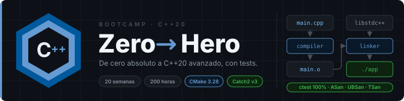

<p align="center">
  
</p>

<p align="center">
  <a href="LICENSE"></a>
  <a href="#"></a>
  <a href="#"></a>
  <a href="#"></a>
  <a href="#"></a>
  <a href="#"></a>
</p>

<p align="center">
  <a href="README.md"></a>
</p>

---

## 📋 Description

A **20-week (~5 months)** bootcamp on **modern C++ (C++20)**, from **absolute zero** to
an **advanced** level: RAII, templates and concepts, the STL, concurrency, coroutines,
measured performance, systems, networking, and hardening with sanitizers and fuzzing.
Self-paced, 10 hours per week, with everything verifiable by compilation and tests.

> The course content (theory, exercises, projects) is written in **Spanish**. Code,
> identifiers and commit messages are in English.

### 🎯 Objectives

By the end of the bootcamp, students will be able to:

- ✅ Explain what the preprocessor, compiler and linker do with a `.cpp` file
- ✅ Model data with explicit types, classes and invariants
- ✅ Manage resources with RAII and smart pointers, with no manual `new`/`delete`
- ✅ Tell copy from move and know when the compiler elides both
- ✅ Design hierarchies with dynamic polymorphism and, when appropriate, static
- ✅ Write generic code with templates and concepts that fail with readable messages
- ✅ Pick the right STL container and algorithm and justify it by complexity
- ✅ Model errors with exceptions, `optional`, `variant` and `expected`
- ✅ Organize a project into libraries, modules and CMake targets with tests
- ✅ Compute at compile time with `constexpr`, traits and CRTP
- ✅ Write correct concurrent code and prove it with TSan
- ✅ Use C++20 coroutines for generators and asynchronous pipelines
- ✅ Measure before optimizing: benchmarks, `perf`, memory layout and allocators
- ✅ Talk to the OS: files, processes, `mmap`, sockets, `epoll`
- ✅ Build an HTTP server with Asio and coroutines
- ✅ Harden code with sanitizers, fuzzing and static analysis
- ✅ Design APIs and libraries with a stable ABI, documented and installable

### 🚀 Why C++20?

> **The language underneath everything else** — engines, browsers, databases,
> compilers, trading, games, embedded systems.

C++20 is the first standard that makes the language *comfortable*: concepts, ranges,
`format`, coroutines, modules. This bootcamp teaches it from day one, without a detour
through 1998 C++ "to understand where it comes from". What you understand is how the
machine works; what you write is modern C++.

---

## 🗓️ Bootcamp Structure

|        Phase          | Weeks | Hours | Main topics                                                          |
| :-------------------: | :---: | :---: | -------------------------------------------------------------------- |
| **Fundamentals**      |  1-4  |  40h  | Toolchain, types, control flow, memory, pointers, classes, RAII, tests |
| **Modern C++ Core**   | 5-10  |  60h  | Move semantics, smart pointers, polymorphism, templates, STL, ranges, errors |
| **Advanced**          | 11-17 |  70h  | Build, metaprogramming, concurrency, coroutines, performance, systems, networking |
| **Production**        | 18-20 |  30h  | Sanitizers, fuzzing, CI, API design, ABI, final project              |

**Total: 20 weeks** | **200 hours** | **10 hours per week**

---

## 📚 Week by Week

Every week contains:

```
bootcamp/week-XX-main_topic/
├── README.md                 # Description and objectives
├── rubrica-evaluacion.md     # Assessment criteria
├── 0-assets/                 # SVG diagrams
├── 1-teoria/                 # Theory
├── 2-practicas/              # Guided exercises with starter/ (CMake + Catch2)
├── 3-proyecto/               # Weekly layer of the domain project
├── 4-recursos/               # Additional resources
│   ├── ebooks-free/
│   ├── videografia/
│   └── webgrafia/
└── 5-glosario/               # Key terms
```

| Week | Topic | Description |
|------|-------|-------------|
| 01 | `toolchain_y_compilacion` | History and standards, g++/clang++, compilation pipeline, minimal CMake, types, I/O |
| 02 | `control_funciones_referencias` | Control flow, functions, references, scope, `string`, `vector`, undefined behavior |
| 03 | `memoria_punteros_arrays` | Stack/heap, pointers, arrays, `span`, `new`/`delete`, gdb, ASan, C strings |
| 04 | `clases_raii_tests` | Classes, constructors, RAII, operators, `<=>`, Catch2, `ctest` |
| 05 | `copia_movimiento_smart_pointers` | Rule of 0/3/5, rvalues, `move`, `forward`, `unique_ptr`, `shared_ptr`, `weak_ptr`, elision |
| 06 | `herencia_polimorfismo` | `virtual`, vtable, interfaces, slicing, RTTI, composition over inheritance |
| 07 | `templates_conceptos` | Templates, deduction, specialization, concepts, variadics, reading errors |
| 08 | `stl_contenedores_iteradores` | Sequences, associative, hashing, iterators, adaptors, choosing a container |
| 09 | `algoritmos_lambdas_ranges` | Lambdas, `<algorithm>`, `<numeric>`, ranges, views, projections |
| 10 | `errores_optional_variant` | Exceptions, guarantees, `noexcept`, `optional`, `variant`, `expected` |
| 11 | `modulos_build_tooling` | ODR, pimpl, C++20 modules, multi-target CMake, clang-tidy, dependencies |
| 12 | `metaprogramacion_constexpr` | `constexpr`/`consteval`, traits, `if constexpr`, CRTP, type erasure |
| 13 | `concurrencia_threads_sincronizacion` | `jthread`, mutex, `condition_variable`, atomics, thread pool, TSan |
| 14 | `memory_model_async_coroutines` | `memory_order`, lock-free, `async`/`future`, `latch`/`barrier`, coroutines |
| 15 | `rendimiento_profiling` | Cache, layout, SoA/AoS, allocators, PMR, benchmarks, `perf`, SIMD |
| 16 | `io_filesystem_sistemas` | `filesystem`, binary I/O, processes, signals, `mmap`, `extern "C"` |
| 17 | `redes_sockets_asio` | POSIX sockets, `epoll`, Asio, networked coroutines, HTTP/1.1 |
| 18 | `seguridad_sanitizers_fuzzing` | ASan/UBSan/TSan, libFuzzer, Core Guidelines, GSL, static analysis, CI |
| 19 | `diseno_patrones_api` | Modern patterns, API design, architecture, ABI, Doxygen, install |
| 20 | `proyecto_final` | Spec, code review, complete domain system, presentation |

### 🔑 Key Components

- 📖 **Theory**: one file per concept, with every snippet compiled
- 💻 **Practice**: uncomment-to-learn guided exercises with Catch2 tests already written
- 🧵 **Project**: one system in the student's own domain, growing over 20 weeks
- 📝 **Assessment**: knowledge, performance and product, verified by `ctest`
- 🎓 **Resources**: glossaries, references and complementary material

---

## 🛠️ Tech Stack

| Technology       | Version        | Use                                     |
| ---------------- | -------------- | --------------------------------------- |
| C++              | **C++20**      | Language (C++23 flagged where it appears) |
| GCC              | **13+**        | Primary compiler                        |
| Clang            | **17+**        | Secondary compiler, sanitizers, fuzzer, clang-tidy |
| CMake            | **3.28+**      | Build system, presets                   |
| Ninja            | **1.11+**      | Generator (optional)                    |
| Catch2           | **v3**         | Tests                                   |
| Google Benchmark | **1.9**        | Microbenchmarks (week 15)               |
| Asio             | **1.38**       | Asynchronous networking (week 17)       |
| gdb / lldb       | **12+ / 17+**  | Debugging                               |
| ASan/UBSan/TSan  | compiler's     | UB, memory and data-race detection      |
| libFuzzer        | Clang's        | Fuzzing (week 18)                       |
| clang-format / clang-tidy | **17+** | Formatting and static analysis         |
| GitHub Actions   | —              | CI (week 18)                            |

**Development environment**: Linux or WSL2 + VS Code (cpptools or clangd) + CMake Tools.
See [`docs/setup.md`](docs/setup.md) (Spanish).

---

## 🚀 Quick Start

### Prerequisites

- **GCC 13+ or Clang 17+**, **CMake 3.28+** — install guide in [`docs/setup.md`](docs/setup.md)
- **Git**
- **VS Code** (recommended) with the extensions in `.vscode/extensions.json`

### 1. Clone the repository

```bash
git clone https://github.com/ergrato-dev/bc-cpp.git
cd bc-cpp
```

### 2. Check the toolchain

```bash
g++ --version && cmake --version
```

### 3. Build the first exercise

```bash
cd bootcamp/week-01-toolchain_y_compilacion/2-practicas/ejercicio-01-hola-toolchain/starter
cmake --preset debug && cmake --build --preset debug && ctest --preset debug
```

### 4. Follow the instructions

Every week has a `README.md` with objectives, contents, time distribution and
deliverables.

---

## 📊 Learning Methodology

### Teaching strategies

- 🎯 **Project-based learning**: one system in your domain that grows every week
- 🏛️ **Unique domains**: every student works on their own domain (anti-copy)
- 🧩 **Uncomment to learn**: exercises ship the explained code and the tests already
  written; you learn by reading, uncommenting and watching tests turn green
- 🔬 **Measure, don't guess**: sanitizers from week 03, benchmarks from week 15
- 👥 **Code review**: week 20 includes peer review

### Time distribution (10 h/week)

| Activity | Time |
| -------- | ---- |
| Theory (4-6 files) | 3 h |
| Guided exercises (2-3) | 3-3.5 h |
| Weekly project | 3 h |
| Self-assessment and glossary | 0.5-1 h |

### Assessment

Every week has three kinds of evidence:

1. **Knowledge 🧠** (30%): quiz with answers at the end of the rubric
2. **Performance 💪** (40%): exercises verified by `ctest` in every starter
3. **Product 📦** (30%): the weekly layer of the domain project

**Passing bar**: at least 70% on each kind of evidence. Compiles with
`-Wall -Wextra -Wpedantic -Werror`, passes `ctest --preset asan`, consistent with the
domain, no copying.

---

## 🏛️ Unique Domain Policy (Anti-copy)

Every student picks (or is assigned) a **unique domain** in Week 01 and keeps it for
all 20 weeks: 📚 Library, 💊 Pharmacy, 🏋️ Gym, 🏫 School, 🐾 Pet shop, 🍽️ Restaurant,
🏦 Bank, 🚕 Taxis, 🏥 Hospital, 🎬 Cinema, 🏨 Hotel, ✈️ Travel, 🚗 Car dealership,
👕 Clothing, 🔧 Workshop and more.

Exercises use a generic `Item`; the project is built on the student's own domain.
Full catalogue and rules in [`docs/dominios.md`](docs/dominios.md).

---

## 📞 Support

- 💬 **Discussions**: [GitHub Discussions](https://github.com/ergrato-dev/bc-cpp/discussions)
- 🐛 **Issues**: [GitHub Issues](https://github.com/ergrato-dev/bc-cpp/issues)
- 🤝 **Contributing**: [CONTRIBUTING.md](CONTRIBUTING.md)

---

## ⚠️ Disclaimer

This repository is an **educational** resource created for learning purposes. By using
it you accept the following terms:

- **Educational purposes only**: the content, code examples and projects are designed
  exclusively for teaching and learning. They do not constitute professional or
  security advice.
- **No warranties**: the material is provided **"as is"**, without warranties of any
  kind, express or implied.
- **Production code**: the examples are illustrative. Before using them in production,
  perform security, performance and context-specific reviews.
- **Software versions**: the compiler and library versions mentioned may become
  outdated. Always check the latest official documentation.
- **Limitation of liability**: the authors and contributors are not responsible for
  data loss, direct or indirect damages, or any other harm derived from the use of
  this material.
- **Student responsibility**: each student is responsible for their own
  implementations, environments and technical decisions.

---

## 📄 License

This project is licensed under **[CC BY-NC-SA 4.0](https://creativecommons.org/licenses/by-nc-sa/4.0/)**
(Creative Commons Attribution-NonCommercial-ShareAlike 4.0 International).

**You may:** share and adapt the material, including educational forks.
**You may not:** use this material for commercial purposes.
**You must:** give appropriate credit and distribute adaptations under the same license.

See the [LICENSE](LICENSE) file for the full text.

---

## 📚 Additional Documentation

- [`docs/README.md`](docs/README.md) — index of cross-cutting documentation
- [`.github/copilot-instructions.md`](.github/copilot-instructions.md) — content conventions
- [`CODE_OF_CONDUCT.md`](CODE_OF_CONDUCT.md) · [`SECURITY.md`](SECURITY.md)

---

<p align="center">
  <strong>🎓 Bootcamp C++ Zero to Hero</strong><br>
  <em>If it doesn't compile with -Werror and has no test, it's not a deliverable.</em>
</p>

<p align="center">
  <a href="bootcamp/week-01-toolchain_y_compilacion/README.md">Start Week 1</a> •
  <a href="docs/README.md">Documentation</a> •
  <a href="https://github.com/ergrato-dev/bc-cpp/issues">Report an Issue</a>
</p>

<p align="center">Made with ❤️ for the developer community</p>
