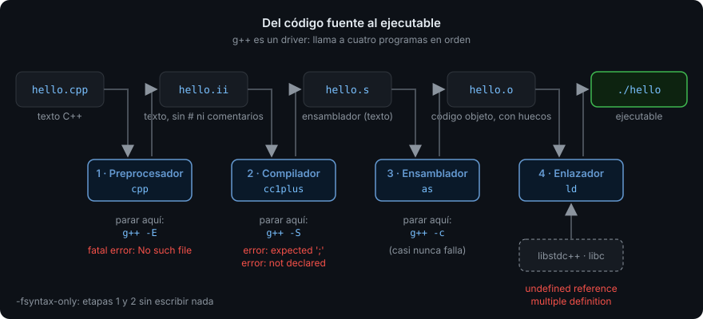
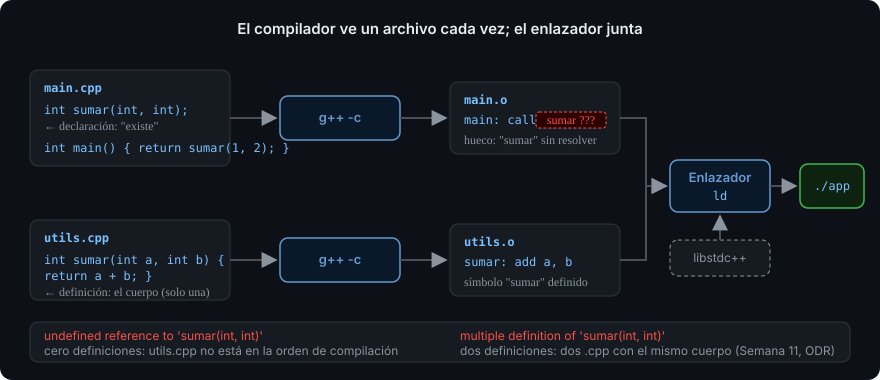

# Del código fuente al ejecutable

> Cuando escribes `g++ hello.cpp` pasan cuatro cosas distintas, hechas por cuatro
> programas distintos. Saber cuál falló es la diferencia entre arreglar un error en un
> minuto o en una tarde.

## 🎯 Objetivos

Al terminar este archivo podrás:

- Nombrar las cuatro etapas que convierten un `.cpp` en un ejecutable y qué produce cada una
- Distinguir un **error de compilación** de un **error de enlace** leyendo el mensaje
- Explicar qué hace `#include` de verdad, y por qué el orden de los includes rara vez importa
- Elegir los flags de `g++` que usa el bootcamp y decir para qué sirve cada uno
- Parar el pipeline en cualquier etapa para mirar qué hay dentro

## 1. Qué problema resuelve

Tu archivo `hello.cpp` es texto. La CPU no ejecuta texto. Entre uno y otro hay una
cadena de transformaciones, y **cada eslabón puede fallar con un mensaje distinto**.
Si no sabes en qué eslabón estás, el mensaje no te dice nada:

```
/usr/bin/ld: main.o: in function `main': undefined reference to `saludar()'
```

Eso no es un error del compilador. Es del **enlazador** (`ld`), y significa que el
compilador aceptó tu código pero nadie le dijo dónde está `saludar`. Arreglarlo no
pasa por tocar la sintaxis; pasa por añadir un archivo a la compilación. Cuando
entiendas el pipeline, este mensaje se lee en dos segundos.

## 2. Cómo funciona



Cuatro etapas, cuatro programas, cuatro tipos de archivo:

| # | Etapa | Programa (GCC) | Entrada | Salida | Qué hace |
| - | ----- | -------------- | ------- | ------ | -------- |
| 1 | **Preprocesado** | `cpp` | `hello.cpp` | `hello.ii` (texto) | Ejecuta las líneas que empiezan por `#`: pega el contenido de los `#include`, sustituye los `#define`, quita los comentarios |
| 2 | **Compilación** | `cc1plus` | `hello.ii` | `hello.s` (texto) | Comprueba tipos y sintaxis, y traduce C++ a **ensamblador**: texto legible que describe instrucciones de CPU |
| 3 | **Ensamblado** | `as` | `hello.s` | `hello.o` (binario) | Traduce ensamblador a **código objeto**: instrucciones de máquina reales, pero con huecos donde iría cualquier cosa definida en otro archivo |
| 4 | **Enlace** | `ld` | `hello.o` + bibliotecas | `hello` (ejecutable) | Junta todos los `.o` y las bibliotecas, rellena los huecos, y produce el archivo que el sistema operativo puede lanzar |

`g++` es un **driver**: un programa que llama a los cuatro en orden y te ahorra
escribirlos. Cuando dice "error", el texto del mensaje delata quién lo dijo:

| El mensaje empieza por… | Etapa | Qué suele significar |
| --- | --- | --- |
| `hello.cpp:3:10: fatal error: iostrem: No such file or directory` | 1, preprocesador | Un `#include` con un nombre que no existe |
| `hello.cpp:5:3: error: 'cout' was not declared in this scope` | 2, compilador | Falta el `std::`, o el `#include` que lo declara |
| `hello.cpp:5:30: error: expected ';' before 'return'` | 2, compilador | Sintaxis: casi siempre un `;` olvidado en la línea **anterior** |
| `/usr/bin/ld: ... undefined reference to 'f()'` | 4, enlazador | Declaraste `f` pero nadie la definió, o el `.cpp` que la define no está en la orden de compilación |
| `/usr/bin/ld: ... multiple definition of 'f()'` | 4, enlazador | Dos `.cpp` definen la misma función. Lo verás a fondo en la Semana 11 (ODR) |

### 2.1 Unidades de traducción



El compilador (etapa 2) **solo ve un archivo cada vez**. Ese archivo, después del
preprocesado, se llama **unidad de traducción** (*translation unit*). Si tu programa
tiene `main.cpp` y `utils.cpp`, son dos unidades independientes: el compilador compila
una sin saber que la otra existe, produce dos `.o`, y el enlazador los junta.

Por eso existe la pareja **declaración / definición**:

- **Declarar** es decir "existe una función `int sumar(int, int);`" sin dar el cuerpo.
  El compilador se conforma con eso para comprobar que la llamas bien.
- **Definir** es dar el cuerpo. Tiene que existir **exactamente una** definición en
  todo el programa; si no, el enlazador se queja (`undefined reference` si cero,
  `multiple definition` si más de una).

Un `#include <iostream>` pega en tu archivo miles de líneas de **declaraciones** (qué
existe en la biblioteca). Las **definiciones** están precompiladas en una biblioteca
(`libstdc++` en GCC, `libc++` en Clang) que el enlazador añade solo. Por eso puedes
usar `std::cout` sin haberlo definido: alguien lo definió por ti, y el enlazador lo
encuentra.

> [!NOTE]
> "Funciones" y "declaración/definición" se ven en detalle en la Semana 02. Aquí solo
> importa la idea: el compilador trabaja archivo a archivo, el enlazador junta.

## 3. Cómo se escribe en C++20

### 3.1 La orden completa y sus flags

```bash
g++ -std=c++20 -Wall -Wextra -Wpedantic -Werror -g hello.cpp -o hello
```

| Flag | Qué hace | Por qué el bootcamp lo exige |
| --- | --- | --- |
| `-std=c++20` | Estándar del lenguaje | Sin él, GCC 13 compila C++17: no hay `std::format` ni conceptos |
| `-Wall` | Activa los warnings "habituales" (variables sin usar, comparaciones sospechosas…) | Un warning es un bug que el compilador ya encontró por ti |
| `-Wextra` | Más warnings (parámetros sin usar, comparación signed/unsigned…) | Idem; el nombre "extra" engaña, son básicos |
| `-Wpedantic` | Rechaza extensiones del compilador que no son C++ estándar | Que tu código compile en Clang y MSVC, no solo en GCC |
| `-Werror` | Convierte todo warning en error | Un warning que se ignora hoy se acumula con cien mañana. Cero desde el principio |
| `-g` | Incluye información de depuración (nombres de variables, números de línea) en el binario | Sin esto, gdb (Semana 03) y los sanitizers no te dicen en qué línea falló |
| `-o hello` | Nombre del archivo de salida | Sin él, el ejecutable se llama `a.out` |

Y los dos que se añaden según la fase:

| Flag | Qué hace | Cuándo |
| --- | --- | --- |
| `-O0` / `-O2` | Nivel de optimización: `-O0` no optimiza (por defecto), `-O2` sí | `-O0 -g` para depurar; `-O2` para medir rendimiento (Semana 15). Nunca mezcles: depurar código optimizado es confuso |
| `-fsanitize=address,undefined` | Instrumenta el binario para detectar errores de memoria y comportamiento indefinido en ejecución | Desde la Semana 03. En CMake es el preset `asan` |

### 3.2 Parar en cada etapa

Puedes pedirle a `g++` que se detenga después de cualquier etapa. Es la forma de
**ver** lo que el pipeline hace, y un truco de depuración real.

```bash
# Solo preprocesar: el resultado es texto, mira cuántas líneas trae <iostream>
g++ -std=c++20 -E hello.cpp -o hello.ii
wc -l hello.ii          # decenas de miles de líneas; tu programa está al final

# Preprocesar y compilar: el resultado es ensamblador legible
g++ -std=c++20 -S hello.cpp -o hello.s
head -40 hello.s        # verás main: y las llamadas a la biblioteca

# Hasta el objeto, sin enlazar
g++ -std=c++20 -c hello.cpp -o hello.o
file hello.o            # "ELF 64-bit LSB relocatable": relocatable = tiene huecos

# Solo comprobar que compila, sin generar nada (el más rápido)
g++ -std=c++20 -Wall -Wextra -Wpedantic -Werror -fsyntax-only hello.cpp
```

`-fsyntax-only` es el que más vas a usar: comprueba el archivo en una fracción de
segundo y no deja ficheros por medio.

### 3.3 Varios archivos

```bash
# Opción A: todo de golpe. g++ compila cada .cpp a .o y luego enlaza.
g++ -std=c++20 -Wall -Wextra -Wpedantic -Werror main.cpp utils.cpp -o app

# Opción B: por pasos. Es lo que hace CMake por ti (archivo 03).
g++ -std=c++20 -Wall -Wextra -Wpedantic -Werror -c main.cpp  -o main.o
g++ -std=c++20 -Wall -Wextra -Wpedantic -Werror -c utils.cpp -o utils.o
g++ main.o utils.o -o app
```

La opción B tiene una ventaja que se nota con cien archivos: si cambias `utils.cpp`,
solo hay que recompilar `utils.o` y volver a enlazar. Gestionar eso a mano es
insostenible; para eso existe un **build system**, que es el tema del archivo 03.

### 3.4 Lo mismo con Clang

```bash
clang++ -std=c++20 -Wall -Wextra -Wpedantic -Werror -g hello.cpp -o hello
```

Los flags son idénticos. La diferencia está en los mensajes: Clang suele señalar con
`^~~~` la posición exacta y sugerir el arreglo ("did you mean 'std::cout'?"). Cuando
un error de GCC no te diga nada, prueba el mismo archivo con `clang++`.

## 4. Antipatrones

| Qué hace la gente | Por qué duele | Qué hacer |
| --- | --- | --- |
| Compilar sin warnings (`g++ hello.cpp`) y arreglar "cuando falle" | Una variable sin inicializar, una comparación signed/unsigned, un `=` donde iba `==`: todos son warnings. Sin `-Wall` compilan en silencio y fallan en ejecución, a veces solo a veces | `-Wall -Wextra -Wpedantic -Werror` desde el primer `hello.cpp`. Es una línea |
| Leer solo la última línea del error | El compilador imprime los errores en orden, y el primero suele **causar** los siguientes: un `;` olvidado genera diez errores en cascada | Arreglar el **primer** error, recompilar, repetir. Nunca intentar arreglar diez a la vez |
| Ignorar `note:` en la salida | Los `note:` son el compilador explicando el `error:` de encima: "declared here", "candidate function", "in instantiation of…" | Leer el `error:` y todos sus `note:` como un bloque. La respuesta suele estar en el segundo `note:` |
| Buscar el `undefined reference` en la sintaxis | El enlazador no mira sintaxis; ese error nunca se arregla tocando el cuerpo de una función | Preguntarse: ¿dónde está **definida** esa función? ¿Está ese `.cpp` en la orden de compilación (o en el `CMakeLists.txt`)? |
| Depurar con `-O2` | El optimizador reordena, elimina y fusiona código. En gdb, las variables "no existen" y las líneas saltan | `-O0 -g` para depurar. `-O2` solo para medir |

## 5. Trucos

- **`-fsyntax-only`** — comprueba un archivo sin generar nada. Ideal para iterar sobre
  errores de compilación: milisegundos por vuelta.
- **Ver qué trae un `#include`** — `g++ -E -std=c++20 x.cpp | grep -c ''` cuenta las
  líneas tras preprocesar. `<iostream>` en GCC 13 son ~43.000. Explica por qué
  compilar C++ es lento y por qué la Semana 11 habla de módulos.
- **Ver el ensamblador de una línea concreta** — pega el archivo en
  https://godbolt.org/ con `-std=c++20 -O2`; al pasar el ratón por una línea de C++ se
  iluminan sus instrucciones. Es el mismo `-S` con colores.
- **Colores y columnas** — `g++ -fdiagnostics-color=always` fuerza colores aunque
  redirijas la salida; `-fdiagnostics-show-caret` (por defecto) dibuja el `^` bajo el
  error.
- **Ver la orden real que ejecuta el driver** — `g++ -v hello.cpp -o hello` imprime
  las llamadas a `cc1plus`, `as` y `ld` con todos sus argumentos. Útil cuando "no
  encuentra" una biblioteca: verás en qué rutas buscó.

## 📚 Recursos Adicionales

- [GCC — Options Controlling the Kind of Output](https://gcc.gnu.org/onlinedocs/gcc/Overall-Options.html) —
  la documentación oficial de `-E`, `-S`, `-c` y compañía. Corta y precisa.
- [GCC — Warning Options](https://gcc.gnu.org/onlinedocs/gcc/Warning-Options.html) —
  qué activa exactamente `-Wall` y `-Wextra`. Para cuando quieras saber por qué el
  compilador se queja de algo.
- [Matt Godbolt — *What Has My Compiler Done for Me Lately?* (CppCon 2017)](https://www.youtube.com/@CppCon) —
  el autor de Compiler Explorer enseñando a leer ensamblador sin miedo. Busca el título
  en el canal.
- [cppreference — Translation phases](https://en.cppreference.com/w/cpp/language/translation_phases) —
  las fases exactas que define el estándar (son nueve, no cuatro; las cuatro de arriba
  son cómo las agrupa el toolchain). Para cuando quieras el detalle.

## ✅ Checklist de Verificación

- [ ] Puedo nombrar las cuatro etapas del pipeline y qué archivo produce cada una
- [ ] Dado un mensaje de error, sé decir si viene del preprocesador, del compilador o
      del enlazador, y qué tipo de arreglo necesita cada uno
- [ ] Puedo explicar qué es una unidad de traducción y por qué el compilador no ve
      `utils.cpp` cuando compila `main.cpp`
- [ ] Sé qué hace cada uno de `-std=c++20 -Wall -Wextra -Wpedantic -Werror -g`
- [ ] He generado un `.ii`, un `.s` y un `.o` de mi `hello.cpp` y he mirado dentro
- [ ] He provocado a propósito un `undefined reference` y lo he arreglado sin tocar
      la sintaxis
