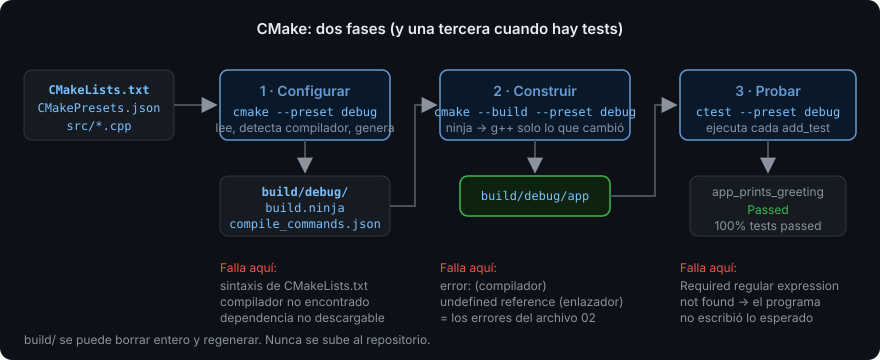

# CMake mínimo

> Nadie compila un proyecto real escribiendo `g++` a mano. CMake es la forma en que el
> ecosistema C++ describe **qué** construir; a partir de hoy, cada starter del bootcamp
> es un `CMakeLists.txt`.

## 🎯 Objetivos

Al terminar este archivo podrás:

- Explicar qué es un **build system** y qué problema resuelve frente a llamar a `g++`
- Distinguir las dos fases de CMake, **configurar** y **construir**, y saber qué falla en cada una
- Leer y escribir un `CMakeLists.txt` mínimo con un ejecutable y sus flags
- Usar `CMakePresets.json` para no memorizar líneas de comandos
- Ejecutar `ctest` y entender qué comprueba un test en las semanas 01-03

## 1. Qué problema resuelve

Con un archivo, `g++ hello.cpp` basta. Con veinte archivos, tres bibliotecas y dos
compiladores, no. Necesitas algo que:

1. **Sepa qué depende de qué** y recompile solo lo que cambió. Tocar `utils.cpp` no
   debería recompilar `main.cpp`.
2. **Describa el proyecto una vez** y funcione en Linux con GCC, en macOS con Clang y
   en Windows con MSVC. Los flags son distintos en cada uno; tú no quieres saberlo.
3. **Integre tests, dependencias e instalación** sin scripts a mano.

Eso es un **build system** (sistema de construcción). Hay varios (`make`, `ninja`,
`meson`, `bazel`). CMake no es exactamente uno de ellos: es un **generador** de build
systems. Tú describes el proyecto en un lenguaje propio; CMake produce los archivos
para `make` o `ninja`, y esos hacen el trabajo. Suena a capa de más, y lo es; pero es
la capa que usa la inmensa mayoría del ecosistema C++, y la que entienden todos los
editores, así que es la que se aprende.

## 2. Cómo funciona



Dos fases, siempre en este orden:

| Fase | Comando | Qué pasa | Qué puede fallar |
| --- | --- | --- | --- |
| **Configurar** | `cmake -S . -B build` | Lee `CMakeLists.txt`, detecta el compilador, resuelve dependencias y genera `build/build.ninja` (o un `Makefile`) | Error de sintaxis en `CMakeLists.txt`, compilador no encontrado, dependencia no descargable |
| **Construir** | `cmake --build build` | Llama a `ninja`, que ejecuta las órdenes de `g++` necesarias, solo para lo que cambió | Errores de compilación o de enlace: los del archivo 02 |

`-S .` es el directorio **fuente** (donde está `CMakeLists.txt`); `-B build` es el
directorio de **construcción**, donde van todos los archivos generados. Esa separación
es sagrada: `build/` se puede borrar entero y regenerar, y nunca se sube al
repositorio (está en `.gitignore`).

Y una tercera fase cuando hay tests:

| Fase | Comando | Qué pasa |
| --- | --- | --- |
| **Probar** | `ctest --test-dir build` | Ejecuta cada test registrado en `CMakeLists.txt` y reporta cuáles pasan |

### 2.1 Targets

CMake piensa en **targets**: cosas que se construyen. Un ejecutable es un target; una
biblioteca es un target. Todo lo demás (flags, includes, dependencias) se **cuelga de
un target**, no se declara en global. Esa es la diferencia entre el CMake moderno
(2014 en adelante) y los tutoriales viejos llenos de `set(CMAKE_CXX_FLAGS ...)`.

## 3. Cómo se escribe en C++20

### 3.1 El `CMakeLists.txt` mínimo

Este es el de los starters de las semanas 01-03, línea a línea:

```cmake
# Versión mínima de CMake que este archivo necesita. 3.28 trae presets v6 y módulos.
cmake_minimum_required(VERSION 3.28)

# Nombre del proyecto y lenguajes. Sin LANGUAGES CXX, CMake también buscaría un
# compilador de C, y fallaría en máquinas que solo tienen g++.
project(hola_toolchain LANGUAGES CXX)

# Estándar del lenguaje. Las tres líneas van juntas siempre:
set(CMAKE_CXX_STANDARD 20)           # -std=c++20
set(CMAKE_CXX_STANDARD_REQUIRED ON)  # error si el compilador no lo soporta, en vez de bajar a C++17
set(CMAKE_CXX_EXTENSIONS OFF)        # -std=c++20, no -std=gnu++20 (sin extensiones de GCC)

# Un target ejecutable llamado "app", construido a partir de estos archivos.
add_executable(app src/main.cpp)

# Flags de warnings, colgados del target. PRIVATE = solo para compilar "app",
# no para quien lo use (nadie usa un ejecutable, pero la costumbre importa).
target_compile_options(app PRIVATE -Wall -Wextra -Wpedantic -Werror)

# Tests. enable_testing() activa ctest; add_test registra uno.
enable_testing()
add_test(NAME app_prints_greeting COMMAND app)
set_tests_properties(app_prints_greeting PROPERTIES
  PASS_REGULAR_EXPRESSION "Hola, C\\+\\+20")
```

Las últimas tres líneas son el mecanismo de test de las semanas 01-03: **ejecuta el
programa y comprueba que su salida contiene un texto**. `PASS_REGULAR_EXPRESSION` es
una expresión regular; por eso los `+` van escapados (`\\+`). A partir de la Semana 04,
cuando sepas escribir funciones y clases, los tests serán código C++ con Catch2.

> [!NOTE]
> `-Wall -Wextra -Wpedantic -Werror` son flags de GCC y Clang. En MSVC no existen
> (serían `/W4 /WX`). Los starters asumen GCC o Clang, como dice `docs/setup.md`; si
> algún día necesitas MSVC, se envuelve en `if(MSVC)`. No antes: no añadas soporte a
> plataformas que no usas.

### 3.2 Los presets

Escribir `cmake -S . -B build -G Ninja -DCMAKE_BUILD_TYPE=Debug -DCMAKE_CXX_FLAGS=-fsanitize=...`
cada vez es insostenible. `CMakePresets.json` guarda esas combinaciones con nombre.
Todos los starters copian el mismo, de
[`docs/plantillas/CMakePresets.json`](../../../docs/plantillas/CMakePresets.json):

| Preset | Qué configura | Cuándo |
| --- | --- | --- |
| `debug` | `-O0 -g`, sin optimizar, con símbolos | Trabajo diario |
| `release` | `-O2`, optimizado | Medir rendimiento (Semana 15) |
| `asan` | `debug` + `-fsanitize=address,undefined` | Antes de entregar cualquier cosa, desde la Semana 03 |
| `tsan` | `debug` + `-fsanitize=thread` | Semanas 13-14 |

Con presets, el ciclo entero son tres órdenes que no cambian nunca:

```bash
cmake --preset debug           # configurar → build/debug/
cmake --build --preset debug   # construir
ctest --preset debug           # probar
```

Cada preset construye en su propio directorio (`build/debug`, `build/asan`), así que
puedes tener los dos configurados a la vez sin que se pisen.

### 3.3 El ciclo de trabajo real

```bash
cd starter
cmake --preset debug                       # una vez (o cuando cambie CMakeLists.txt)
cmake --build --preset debug && ctest --preset debug   # en cada cambio
```

Si editas `src/main.cpp`, solo el segundo comando. Si editas `CMakeLists.txt`, CMake
detecta el cambio y se reconfigura solo al construir. Si algo raro pasa,
`rm -rf build` y vuelta a empezar: es la ventaja de separar fuente y construcción.

### 3.4 Leer la salida de ctest

```
Test project /home/tu/starter/build/debug
    Start 1: app_prints_greeting
1/1 Test #1: app_prints_greeting ..........   Passed    0.00 sec

100% tests passed, 0 tests failed out of 1
```

Y cuando falla:

```
1/1 Test #1: app_prints_greeting ..........***Failed  Required regular expression not found. Regex=[Hola, C\+\+20]
```

`ctest --preset debug --output-on-failure` (los presets ya lo activan) imprime además
la salida del programa, para que veas qué escribió en vez de lo esperado.

## 4. Antipatrones

| Qué hace la gente | Por qué duele | Qué hacer |
| --- | --- | --- |
| `set(CMAKE_CXX_FLAGS "-Wall -O2")` en global | Afecta a **todo** lo que se compile, incluidas las dependencias descargadas, que pueden no compilar con tus warnings. Y `-O2` en global impide depurar | Flags por target con `target_compile_options`. La optimización la decide el preset (`CMAKE_BUILD_TYPE`), no el `CMakeLists.txt` |
| Construir dentro del directorio fuente (`cmake .`) | Llena la carpeta de `CMakeFiles/`, `Makefile`, `.o`; imposible limpiar; acaba en el repositorio | Siempre `-B build` o un preset. `build/` está en `.gitignore` |
| `file(GLOB SOURCES src/*.cpp)` | CMake no se entera cuando añades un archivo nuevo: hay que reconfigurar a mano, y el error ("undefined reference") no dice eso | Listar los archivos explícitamente en `add_executable`. Cuando añadas uno, lo añades ahí. Es una línea |
| Copiar un `CMakeLists.txt` de 2012 | `include_directories`, `link_libraries`, `CMAKE_CXX_FLAGS`… el CMake "de variables globales" que la documentación actual desaconseja | Si no ves `target_` delante de casi todo, es viejo. La referencia es [cmake.org/cmake/help/latest](https://cmake.org/cmake/help/latest/) |
| Ignorar `CMAKE_CXX_EXTENSIONS OFF` | Sin él, GCC compila con `-std=gnu++20` y acepta extensiones (VLAs, `typeof`) que Clang y MSVC rechazan. Tu código "funciona" hasta que cambias de compilador | Las tres líneas del estándar van siempre juntas. Están en la plantilla |

## 5. Trucos

- **Ver los comandos reales de compilación** — `cmake --build --preset debug -- -v`
  (el `--` pasa lo que sigue a `ninja`). Verás cada `g++ ... -c ...` con todos sus
  flags: la forma de comprobar que `-Werror` está de verdad.
- **`compile_commands.json`** — los presets lo generan en `build/debug/`. Es la lista
  de cómo se compila cada archivo, y es lo que leen clangd, VS Code, clang-tidy y
  cualquier herramienta moderna. Si el editor "no encuentra" un header, casi siempre
  es porque no está apuntando a este archivo.
- **Reconfigurar desde cero sin borrar** — `cmake --preset debug --fresh` descarta la
  caché de la configuración anterior. Más rápido que `rm -rf build` cuando ya has
  descargado dependencias.
- **Cambiar de compilador sin tocar nada** — `CXX=clang++ cmake --preset debug`.
  CMake lee la variable de entorno `CXX` la primera vez que configura. Para volver a
  GCC: `--fresh` con `CXX=g++`.
- **Ejecutar un solo test** — `ctest --preset debug -R greeting` corre solo los tests
  cuyo nombre encaja con la expresión regular. Con veinte tests, es lo que usas.

## 📚 Recursos Adicionales

- [CMake — Tutorial oficial](https://cmake.org/cmake/help/latest/guide/tutorial/index.html) —
  los pasos 1 y 2 cubren exactamente lo de este archivo, con el estilo moderno. Los
  siguientes pasos son la Semana 11.
- [CMake — `cmake-presets(7)`](https://cmake.org/cmake/help/latest/manual/cmake-presets.7.html) —
  la referencia del formato de `CMakePresets.json`. Para cuando quieras añadir un preset.
- [CMake — `ctest(1)`](https://cmake.org/cmake/help/latest/manual/ctest.1.html) —
  todas las opciones de `ctest`, incluidas `-R`, `-j` y `--rerun-failed`.
- [*An Introduction to Modern CMake*](https://cliutils.gitlab.io/modern-cmake/) —
  libro web gratuito que explica **por qué** el CMake moderno es como es. Corto y
  opinado en la dirección correcta.

## ✅ Checklist de Verificación

- [ ] Puedo explicar qué hace `cmake --preset debug` y qué hace
      `cmake --build --preset debug`, y qué tipo de error sale en cada uno
- [ ] Sé qué es un target y por qué los flags se cuelgan de él y no de una variable global
- [ ] Puedo escribir de memoria un `CMakeLists.txt` con un ejecutable, sus flags y un test
- [ ] Sé por qué `build/` nunca se sube al repositorio
- [ ] He visto con `-- -v` la orden de `g++` que CMake ejecuta y he comprobado que lleva `-Werror`
- [ ] He hecho fallar un test a propósito y he leído el mensaje de `ctest`
