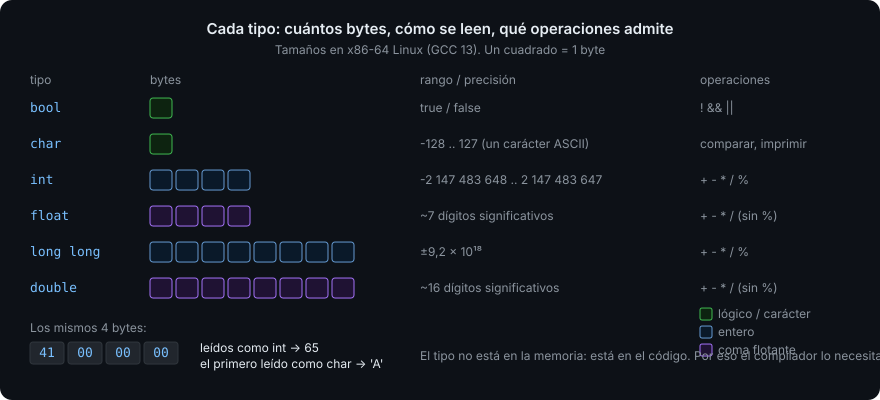

# Tipos, variables y constantes

> En C++ cada variable tiene un tipo fijo, un tamaño fijo y una dirección en memoria.
> Eso es lo que hace al lenguaje rápido, y es también la fuente de la mitad de sus
> errores clásicos. Hoy aprendes a estar en el lado bueno.

## 🎯 Objetivos

Al terminar este archivo podrás:

- Explicar qué es un **tipo** y por qué el compilador necesita conocerlo antes de ejecutar nada
- Elegir entre `int`, `long`, `double`, `bool`, `char` y `std::string` con criterio
- Declarar variables con **inicialización uniforme** `{}` y saber qué error evita
- Usar `auto` cuando aporta y evitarlo cuando esconde
- Distinguir `const` de `constexpr` y saber cuál poner por defecto
- Reconocer una **conversión implícita** peligrosa antes de que el compilador te avise

## 1. Qué problema resuelve

Un lenguaje interpretado como Python decide en ejecución qué es cada cosa: `x = 5` y
luego `x = "hola"`, y funciona. Eso cuesta: cada operación pregunta "¿qué tipo tienes
ahora?". C++ elimina esa pregunta: **cada variable tiene un tipo desde que nace hasta
que muere**, y el compilador genera exactamente las instrucciones de máquina para ese
tipo. Una suma de `int` es una instrucción de CPU. No hay comprobación en ejecución.

El precio es que tú decides el tipo, y si decides mal, el compilador te lo dice (bien)
o el programa hace algo raro sin avisar (mal). Este archivo es sobre decidir bien.

## 2. Cómo funciona

### 2.1 Qué es un tipo

Un **tipo** responde a tres preguntas sobre un valor: **cuántos bytes ocupa**, **cómo
se interpretan esos bytes** y **qué operaciones admite**. `int` son 4 bytes que se leen
como un entero con signo y admiten `+ - * / %`. `double` son 8 bytes que se leen como
un número real (coma flotante) y admiten `+ - * /` pero no `%`. Los mismos 4 bytes
`01000001 00000000 00000000 00000000` son el `int` 65 o el `char` `'A'` según el tipo
con el que los leas.



### 2.2 Los tipos fundamentales

| Tipo | Tamaño típico (x86-64 Linux) | Rango | Para qué |
| --- | --- | --- | --- |
| `bool` | 1 byte | `true` / `false` | Condiciones. Nunca `int` para "sí/no" |
| `char` | 1 byte | -128..127 | **Un carácter** (ASCII). No para números pequeños |
| `int` | 4 bytes | ±2.147.483.647 | El entero por defecto. Contadores, índices pequeños, cantidades |
| `long long` | 8 bytes | ±9,2 × 10¹⁸ | Enteros que no caben en `int`: milisegundos desde 1970, tamaños de archivo |
| `unsigned int` | 4 bytes | 0..4.294.967.295 | Bits y máscaras. **No** para "un número que no puede ser negativo" (ver antipatrones) |
| `float` | 4 bytes | ~7 dígitos significativos | Gráficos y juegos, donde el espacio importa más que la precisión |
| `double` | 8 bytes | ~16 dígitos significativos | **El real por defecto**. Dinero no: ver más abajo |
| `std::size_t` | 8 bytes | 0..1,8 × 10¹⁹ | Tamaños y cuentas de la biblioteca estándar (`.size()` devuelve esto) |

"Típico" porque el estándar solo garantiza mínimos (`int` ≥ 16 bits) y relaciones
(`short` ≤ `int` ≤ `long`). Cuando el tamaño exacto importe, en la Semana 03 verás
`std::int32_t` y compañía. El tamaño real lo da `sizeof`:

```cpp
#include <iostream>

int main() {
  std::cout << sizeof(int) << '\n';      // 4 en x86-64
  std::cout << sizeof(double) << '\n';   // 8
  std::cout << sizeof(bool) << '\n';     // 1
}
```

`sizeof` se resuelve **en compilación**: no cuesta nada en ejecución.

### 2.3 Texto

`char` es un carácter. Para texto, la biblioteca estándar da `std::string`
(`#include <string>`): una secuencia de caracteres que crece sola. Se verá a fondo en
la Semana 02; esta semana basta con declararla, concatenarla e imprimirla.

```cpp
#include <string>

std::string name{"Ada"};
std::string greeting{"Hola, " + name};   // + concatena
```

## 3. Cómo se escribe en C++20

### 3.1 Declarar e inicializar

```cpp
int count{0};              // ✅ inicialización uniforme: llaves
double price{9.99};
bool ready{true};
char initial{'A'};         // comillas simples para char
std::string name{"Ada"};   // comillas dobles para texto
```

Las llaves `{}` son la forma que el bootcamp usa siempre, por una razón concreta:
**rechazan conversiones que pierden información**.

```cpp
int a = 3.7;    // ❌ compila sin aviso (ni -Wall ni -Wextra activan -Wconversion): a vale 3, el .7 desaparece
int b{3.7};     // ✅ error: narrowing conversion of '3.7000000000000002e+0' from 'double' to 'int' [-Wnarrowing]
```

Con `=` el compilador convierte y calla. Con `{}` se niega. Es la diferencia entre
descubrir el bug ahora o dentro de tres meses.

> [!WARNING]
> Una variable declarada **sin inicializar** (`int x;`) contiene basura: lo que hubiera
> en esa memoria antes. Leerla es **comportamiento indefinido** (UB, *undefined
> behavior*): el estándar no dice qué pasa, y el compilador puede hacer cualquier cosa.
> Lo verás en profundidad en la Semana 02. Hoy la regla es simple: **toda variable
> nace con un valor**. `int x{};` es cero; `int x;` es un bug esperando.

### 3.2 `const` y `constexpr`

```cpp
const double kTaxRate{0.21};          // no cambia después de inicializarse
constexpr int kMaxItems{100};         // no cambia Y se conoce en compilación
```

| | `const` | `constexpr` |
| --- | --- | --- |
| ¿Puede cambiar después? | No | No |
| ¿Se conoce el valor al compilar? | No necesariamente (puede venir de leer un archivo) | **Sí, obligatoriamente** |
| ¿Cuándo usarlo? | Valores que se calculan en ejecución y luego no cambian | Constantes de verdad: límites, tasas fijas, tamaños |

La regla del bootcamp: **`constexpr` si puedes, `const` si no, mutable solo si hace
falta**. La mayoría de las variables de un programa bien escrito no cambian nunca
después de nacer; marcarlas lo documenta y deja que el compilador te avise si alguien
las toca.

Las constantes se nombran con prefijo `k` y PascalCase (`kMaxItems`) por convención
del bootcamp, heredada de la guía de estilo de Google. Verás `MAX_ITEMS` en código
viejo: era la convención de `#define`, que no se usa (ver antipatrones).

### 3.3 `auto`

```cpp
auto count{0};             // int: el literal 0 es int
auto price{9.99};          // double
auto name{std::string{"Ada"}};   // std::string
```

`auto` le pide al compilador que **deduzca** el tipo del inicializador. No es "sin
tipo": el tipo existe y es fijo; solo no lo escribes. Cuándo aporta y cuándo esconde:

| Situación | ¿`auto`? | Por qué |
| --- | --- | --- |
| `auto x{std::string{"a"}};` | ✅ | El tipo está a la derecha; repetirlo a la izquierda es ruido |
| `auto n{items.size()};` | ✅ | El tipo real es `std::size_t`; escribir `int` sería una conversión silenciosa |
| `auto total{0};` para sumar `double` | ❌ | Deduce `int`; al sumar `9.99` se trunca. Escribe `double total{0.0};` |
| `auto ok{is_valid(x)};` | Depende | Si por el nombre no queda claro que es `bool`, escríbelo |

Regla: `auto` cuando el tipo es obvio a la derecha o cuando escribirlo sería
**mentir**; tipo explícito cuando informa al lector.

### 3.4 Literales

| Escribes | Tipo | Nota |
| --- | --- | --- |
| `42` | `int` | |
| `42L`, `42LL` | `long`, `long long` | |
| `42U` | `unsigned int` | |
| `3.14` | `double` | **No** `float`: `3.14f` es `float` |
| `'a'` | `char` | Un solo carácter |
| `"hola"` | `const char[5]` | Cadena de C: 4 letras + terminador. Envuélvela en `std::string{}` |
| `true`, `false` | `bool` | |
| `1'000'000` | `int` | El apóstrofo separa dígitos y el compilador lo ignora |
| `0xFF`, `0b1010` | `int` | Hexadecimal, binario |

### 3.5 Conversiones y aritmética

```cpp
int a{7};
int b{2};
std::cout << a / b << '\n';          // 3   — división ENTERA: ambos son int
std::cout << a / 2.0 << '\n';        // 3.5 — uno es double, el otro se convierte
std::cout << a % b << '\n';          // 1   — resto
std::cout << static_cast<double>(a) / b << '\n';   // 3.5 — conversión explícita
```

`static_cast<T>(x)` es **la** forma de convertir en C++. Dice al lector "sé que estoy
cambiando de tipo y lo hago a propósito". La forma de C, `(double)a`, se prohíbe en
el bootcamp: es invisible al buscarla y hace conversiones que `static_cast` rechaza.

Dos conversiones que muerden:

```cpp
unsigned int u{0};
u = u - 1;              // ✅ definido: da 4294967295 (da la vuelta). Sorprende, pero es legal.

int i{2147483647};      // el máximo de int
// i = i + 1;           // ❌ UB: desbordamiento con signo. No es "da la vuelta": es indefinido.
                        //    Lo detecta -fsanitize=undefined: "signed integer overflow"
```

## 4. Antipatrones

| Qué hace la gente | Por qué duele | Qué hacer |
| --- | --- | --- |
| `int x;` sin inicializar "porque luego le asigno" | Si el "luego" no llega por alguna rama, lees basura: UB. `-Wall` avisa a veces (`-Wuninitialized`), no siempre | `int x{};` siempre. Cero es gratis |
| `double` para dinero | `0.1 + 0.2 == 0.3` es `false` en coma flotante. Con céntimos acumulados, el error crece | Enteros en la unidad mínima: `long long cents{1999};`. Formatear al imprimir |
| `unsigned` para "no puede ser negativo" | `unsigned n{0}; n - 1` es 4 mil millones. Los bucles hacia atrás con `unsigned` nunca terminan. Compararlo con un `int` da warning y comportamiento raro | `int` para cantidades, aunque no puedan ser negativas. `unsigned` solo para bits. (La biblioteca estándar usa `size_t` por razones históricas; convive con ello) |
| `#define MAX 100` | No tiene tipo, no respeta ámbitos, el compilador no lo ve (lo sustituye el preprocesador) y los errores hablan de `100`, no de `MAX` | `constexpr int kMax{100};` |
| `float` "para ahorrar" | 7 dígitos. `float f{16777217.0f}` vale 16777216. Ahorras 4 bytes y pierdes precisión sin darte cuenta | `double` por defecto. `float` solo cuando tienes millones y sabes por qué |
| Casts de C: `(int)x` | Invisible al buscar (`grep static_cast` no lo encuentra), y hace conversiones peligrosas que C++ separa en cuatro casts distintos | `static_cast<int>(x)`. Los otros tres casts llegan en semanas posteriores |
| `auto` en todo | `auto x{0};` cuando querías `double`. `auto s{"hola"};` es `const char*`, no `std::string` | `auto` cuando el tipo es obvio a la derecha; explícito cuando informa |

## 5. Trucos

- **Ver el tipo que dedujo `auto`** — provoca un error a propósito:
  `auto x{items.size()}; x.no_existe();` y el compilador dirá
  `'x' (type 'std::size_t') has no member`. Más rápido que buscar la documentación.
  Cuando sepas templates (Semana 07) verás una forma más limpia.
- **Los límites exactos de cada tipo** están en `<limits>`:
  `std::numeric_limits<int>::max()` es 2147483647. Los usarás en el ejercicio 02.
- **Separadores en literales grandes** — `1'000'000'000` es legal desde C++14 y evita
  contar ceros. El compilador lo ignora.
- **Compilar con `-Wconversion`** — no está en `-Wall` ni en `-Wextra`, pero avisa de
  toda conversión que pueda perder datos (`double` → `int`, `long` → `int`). Pruébalo
  una vez sobre tu proyecto y mira cuánto sale.

## 📚 Recursos Adicionales

- [cppreference — Fundamental types](https://en.cppreference.com/w/cpp/language/types) —
  la tabla completa de tipos con sus tamaños garantizados. Para cuando "típico" no baste.
- [cppreference — List-initialization](https://en.cppreference.com/w/cpp/language/list_initialization) —
  qué hace exactamente `{}` y qué rechaza. Es más profundo de lo que parece; hoy basta
  con la sección "narrowing conversions".
- [C++ Core Guidelines — ES.20: Always initialize an object](https://isocpp.github.io/CppCoreGuidelines/CppCoreGuidelines#es20-always-initialize-an-object) —
  la regla, con los ejemplos de cómo se rompe.
- [*What Every Programmer Should Know About Floating-Point Arithmetic*](https://floating-point-gui.de/) —
  por qué `0.1 + 0.2 != 0.3`, en dos páginas. Lee la primera hoy; el resto cuando te muerda.

## ✅ Checklist de Verificación

- [ ] Puedo explicar qué tres cosas define un tipo y por qué `int` y `float` de 4 bytes
      no son intercambiables
- [ ] Sé qué error evita `int x{3.7};` que `int x = 3.7;` deja pasar
- [ ] Sé qué diferencia a `const` de `constexpr` y cuál pongo por defecto
- [ ] Puedo dar dos casos donde `auto` mejora el código y uno donde lo empeora
- [ ] Sé por qué `7 / 2` es 3 y cómo obtener 3.5 sin cambiar las variables
- [ ] Sé por qué no uso `double` para dinero ni `unsigned` para cantidades
- [ ] He visto con `sizeof` los tamaños de los tipos en mi máquina
