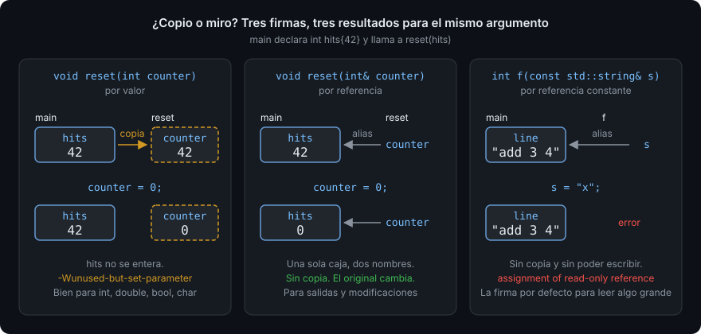

# Funciones

> Una función es un trozo de programa con nombre, entrada y salida. Es la unidad
> mínima de reutilización, de prueba y de lectura. Y la primera pregunta que hace
> cualquier función en C++ es la que persigue a todo el lenguaje: ¿esto que me pasas
> lo copio o lo miro?

## 🎯 Objetivos

Al terminar este archivo podrás:

- Declarar y definir una función, y explicar por qué el compilador exige verla
  declarada antes de la llamada
- Elegir para cada parámetro entre **por valor**, **por referencia** y **por
  referencia constante**, y justificarlo por coste y por intención
- Devolver un valor y saber qué pasa con las variables locales cuando la función termina
- Usar `[[nodiscard]]` para que ignorar un resultado sea un error de compilación
- Reconocer una **sobrecarga** y saber cuándo aclara y cuándo confunde

## 1. Qué problema resuelve

Un `main` de 300 líneas que lee, valida, calcula e imprime no se puede probar por
partes ni leer de un vistazo. Si el cálculo del IVA está escrito tres veces, se
corrige dos. Una **función** es un bloque de código con nombre que recibe datos
(**parámetros**), hace algo y opcionalmente devuelve un resultado (**valor de
retorno**). Escribirla una vez y llamarla tres veces resuelve la repetición; darle un
nombre resuelve la lectura; poder llamarla sola resuelve la prueba.

Ya has usado funciones sin escribirlas: `std::getline`, `std::format`, `main`. Esta
semana escribes las tuyas.

## 2. Cómo funciona

### 2.1 Declarar y definir

```cpp
#include <iostream>

// Declaración: nombre, tipo de retorno, parámetros. Promete que existe.
int add(int a, int b);

int main() {
  std::cout << add(3, 4) << '\n';   // 7
}

// Definición: la declaración más el cuerpo. Cumple la promesa.
int add(int a, int b) {
  return a + b;
}
```

`int add(int a, int b);` es la **declaración** (también llamada *prototipo*): dice
al compilador qué tipo devuelve, cómo se llama y qué tipos recibe. La **definición**
añade el cuerpo. El compilador lee el archivo de arriba abajo y en cada llamada
necesita conocer ya la declaración: por eso `add` se declara antes de `main` aunque se
defina después. Si la llamada aparece antes que cualquier declaración, el error es
`'add' was not declared in this scope` (GCC; Clang: `use of undeclared identifier 'add'`).

Una función se puede declarar muchas veces, pero **definir solo una** en todo el
programa. En la Semana 01 viste que el enlazador reporta `undefined reference` cuando
falta la definición, y `multiple definition` cuando sobra.

### 2.2 Qué pasa al llamar

Cuando `main` ejecuta `add(3, 4)`, el programa **salta** al cuerpo de `add` con `a`
valiendo 3 y `b` valiendo 4, ejecuta `return a + b;` y **vuelve** a `main` con el 7
en la mano. `a` y `b` son variables nuevas que nacen en la llamada y mueren en el
`return`. Cada llamada crea las suyas; dos llamadas no comparten nada.

Eso significa que un parámetro **por valor** es una **copia**. Modificarlo dentro no
toca el original:

```cpp
#include <iostream>

void reset(int counter) {
  counter = 0;                 // ❌ toca la copia; GCC y Clang avisan:
}                              //    parameter 'counter' set but not used [-Wunused-but-set-parameter]

int main() {
  int hits{42};
  reset(hits);
  std::cout << hits << '\n';   // 42: el original no se enteró
}
```

`void` como tipo de retorno significa "no devuelve nada". Y este `reset` no hace
nada útil: es el error más común al empezar con funciones. Tan común que el
compilador lo detecta: con `-Wextra -Werror` este archivo **no compila**, porque
asignar a un parámetro que luego no se lee es sospechoso por definición.

### 2.3 Referencias: mirar en vez de copiar

Una **referencia** es un segundo nombre para una variable que ya existe. Se declara
con `&` detrás del tipo, se inicializa una vez y desde entonces es la variable:

```cpp
#include <iostream>

void reset(int& counter) {     // counter ES la variable del llamador
  counter = 0;
}

int main() {
  int hits{42};
  reset(hits);
  std::cout << hits << '\n';   // 0
}
```

No hay copia: `counter` y `hits` son la misma caja. Por eso una referencia sirve para
dos cosas: **modificar** el argumento (como aquí) y **evitar copiar** algo grande.



Copiar un `int` cuesta lo mismo que mirarlo. Copiar un `std::string` de 2.000
caracteres significa reservar memoria y copiar 2.000 bytes en cada llamada. Cuando
solo necesitas **leer** algo grande, la referencia evita la copia; y `const` promete
que no lo tocarás:

```cpp
#include <iostream>
#include <string>

int count_spaces(const std::string& text) {   // sin copia, sin modificar
  int spaces{0};
  for (char c : text) {
    if (c == ' ') {
      ++spaces;
    }
  }
  return spaces;
}

int main() {
  std::string line{"add 3 4"};
  std::cout << count_spaces(line) << '\n';    // 2
}
```

Si dentro de `count_spaces` escribieras `text = "x";`, el compilador lo rechaza. GCC:
`no match for 'operator=' (operand types are 'const std::string' ... and 'const char
[2]')`; con un `const int&` el mensaje es más claro: `assignment of read-only
reference`. `const&` es la forma por defecto de pasar
cualquier cosa que no sea un tipo fundamental. La regla del bootcamp cabe en tres
líneas:

| Quieres | Escribe | Ejemplo |
| --- | --- | --- |
| Leer un tipo pequeño (`int`, `double`, `bool`, `char`) | por valor | `int add(int a, int b)` |
| Leer algo grande sin tocarlo | `const T&` | `int count_spaces(const std::string& text)` |
| Modificar el argumento del llamador | `T&` | `void reset(int& counter)` |

Una referencia **no puede** estar vacía ni cambiar de variable: `int& r;` no compila
(GCC: `'r' declared as reference but not initialized`; Clang: `declaration of
reference variable 'r' requires an initializer`). Eso la hace más segura que el
puntero, que verás en la Semana 03 y que sí puede estar vacío.

### 2.4 Devolver

`return` termina la función y entrega un valor del tipo declarado. Devolver un
`std::string` o un `std::vector` **por valor es lo correcto** y no cuesta una copia
en la práctica: el compilador construye el resultado directamente donde el llamador
lo va a guardar (lo verás con nombre, *elisión de copia*, en la Semana 05).

```cpp
#include <string>

std::string greeting(const std::string& name) {
  std::string result{"Hola, "};
  result += name;
  return result;                // se devuelve sin copia: el compilador lo elide
}
```

Lo que **nunca** se devuelve es una referencia a una variable local: la variable
muere al salir y la referencia apunta a nada. El archivo 03 lo desmonta con detalle.

### 2.5 `[[nodiscard]]`

Cuando el valor devuelto es el motivo de la llamada (un resultado, un `bool` de
"¿ha ido bien?"), ignorarlo es casi siempre un error. `[[nodiscard]]` se lo dice al
compilador:

```cpp
#include <sstream>
#include <string>

[[nodiscard]] bool parse_int(const std::string& text, int& out) {
  std::istringstream in{text};
  return static_cast<bool>(in >> out);   // true si leyó un entero
}

int main() {
  int value{};
  parse_int("42", value);      // ❌ warning: ignoring return value of 'bool parse_int(...)'
  //                              declared with attribute 'nodiscard' [-Wunused-result]
  return value == 42 ? 0 : 1;
}
```

Con `-Werror` la llamada que ignora el `bool` no compila; hay que escribir `if
(parse_int(...))`. `std::istringstream` es un `std::cin` que lee de una cadena; el
archivo 04 lo explica. Este `parse_int` es la pieza central del ejercicio 01.

### 2.6 Sobrecarga

Dos funciones pueden llamarse igual si sus parámetros son distintos. El compilador
elige por los tipos de los argumentos:

```cpp
#include <iostream>
#include <string>

std::string describe(int units) { return std::to_string(units) + " unidades"; }
std::string describe(double price) { return std::to_string(price) + " EUR"; }

int main() {
  std::cout << describe(3) << '\n';      // int    → "3 unidades"
  std::cout << describe(2.5) << '\n';    // double → "2.500000 EUR"
}
```

Eso es **sobrecarga** (*overloading*). Útil cuando la operación es la misma sobre
tipos distintos (imprimir, comparar). Peligrosa cuando cada versión hace algo
diferente: `describe(3)` y `describe(3.0)` llaman a funciones distintas y quien lee no
lo nota. Solo se puede sobrecargar por parámetros, no por tipo de retorno.

## 3. Cómo se escribe en C++20

```cpp
#include <string>
#include <string_view>

// ✅ tipos pequeños por valor
[[nodiscard]] int clamp_stock(int units, int max_units);

// ✅ texto de solo lectura: string_view (archivo 04) o const std::string&
[[nodiscard]] bool starts_with_command(std::string_view line);

// ✅ salida por referencia, con nombre que lo diga
void normalize(std::string& text);

// ✅ el bool que dice "ha ido bien" no se puede ignorar
[[nodiscard]] bool parse_int(std::string_view text, int& out);
```

Reglas de estilo: `snake_case`, un verbo al principio (`parse_`, `count_`, `is_`),
declaración antes de `main`, y funciones de **una pantalla**: si necesitas hacer
scroll para leerla, tiene dos responsabilidades.

## 4. Antipatrones

| Qué hace la gente | Por qué duele | Qué hacer |
| --- | --- | --- |
| `void add_vat(double price)` que modifica `price` | Modifica una copia; el llamador no ve nada. Compila sin aviso | `double with_vat(double price)` que devuelve, o `double& price` si de verdad quieres modificar |
| `void print(std::string text)` | Copia la cadena entera en cada llamada solo para leerla | `const std::string&` o `std::string_view` |
| `bool` de resultado que nadie mira | El error pasa en silencio y aparece diez líneas más tarde como un dato absurdo | `[[nodiscard]]` en la función; `if` en la llamada |
| Devolver `int&` a una variable local | La variable ya no existe cuando el llamador la usa: UB. GCC: `reference to local variable 'x' returned [-Wreturn-local-addr]`; Clang: `[-Wreturn-stack-address]` | Devolver por valor |
| Una función que hace tres cosas | No se puede probar una sin las otras ni nombrar sin una "y" | Tres funciones. Si el nombre lleva "y", divídela |
| Parámetro `int& out` sin `out` en el nombre | Quien lee la llamada `f(x, y)` no sabe que `y` va a cambiar | Nombrarlo `out`, `result`; o mejor, devolver |
| Sobrecargar `save(int)` y `save(double)` con lógicas distintas | `save(3)` y `save(3.0)` hacen cosas diferentes y nadie lo ve | Nombres distintos: `save_units`, `save_price` |

## 5. Trucos

- **¿Copia o referencia? Pregunta a `gdb`** — construye con `debug`, `gdb ./build/debug/app`,
  `break count_spaces`, `run`, `info args`. Si el parámetro es una referencia, `gdb`
  lo muestra como `(const std::string &) @0x7ffc...: "add 3 4"`; si es por valor, sin
  la `@`.
- **`-Werror=unused-parameter`** — está en `-Wextra`. Un parámetro que no usas es o un
  error o una firma que sobra. Si de verdad no lo necesitas, quítale el nombre: `void
  f(int /*unused*/)`.
- **Prototipos arriba, definiciones abajo** — con las declaraciones juntas al
  principio del archivo se lee la "tabla de contenidos" del programa antes que
  el detalle. En la Semana 11 esas declaraciones se van a un archivo `.hpp`.
- **Probar una función sin el programa entero** — pega la función y un `main` de tres
  líneas en Compiler Explorer. Si necesita medio programa para probarse, su firma está
  mal.

## 📚 Recursos Adicionales

- [cppreference — Function declaration](https://en.cppreference.com/w/cpp/language/function) —
  la sintaxis completa. Hoy basta con la primera mitad.
- [cppreference — Reference declaration](https://en.cppreference.com/w/cpp/language/reference) —
  qué es una referencia y qué no puede hacer. La sección sobre *rvalue references* es
  de la Semana 05.
- [cppreference — `[[nodiscard]]`](https://en.cppreference.com/w/cpp/language/attributes/nodiscard) —
  incluye la variante con mensaje: `[[nodiscard("razón")]]` (C++20).
- [C++ Core Guidelines — F.16: For "in" parameters, pass cheaply-copied types by value and others by reference to `const`](https://isocpp.github.io/CppCoreGuidelines/CppCoreGuidelines#f16-for-in-parameters-pass-cheaply-copied-types-by-value-and-others-by-reference-to-const) —
  la tabla de la sección 2.3 sale de aquí. Las vecinas F.17 (in-out) y F.20 (devolver
  por valor) completan la regla.

## ✅ Checklist de Verificación

- [ ] Sé qué diferencia hay entre declarar y definir, y por qué se declara antes de `main`
- [ ] Sé que un parámetro por valor es una copia y qué consecuencia tiene modificarlo
- [ ] Puedo explicar qué es una referencia y por qué `int& r;` no compila
- [ ] Sé cuándo pasar por valor, cuándo por `const&` y cuándo por `&`
- [ ] Sé qué hace `[[nodiscard]]` y qué warning produce ignorar el resultado
- [ ] He visto el warning de devolver una referencia a una variable local
