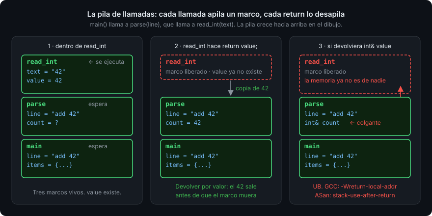

# Alcance y duración

> Cada variable responde a dos preguntas distintas: ¿desde dónde puedo nombrarla? y
> ¿hasta cuándo existe? Confundirlas es la causa del bug más traicionero de C++: usar
> algo que ya no está.

## 🎯 Objetivos

Al terminar este archivo podrás:

- Distinguir **alcance** (dónde se puede nombrar) de **duración** (cuánto vive), y
  señalar ambos para cualquier variable
- Explicar qué es la **pila de llamadas** y por qué las variables locales mueren al
  salir de la función
- Reconocer una variable que **tapa** (*shadowing*) a otra y saber qué flag lo avisa
- Usar `static` dentro de una función y saber por qué casi nunca hace falta
- Agrupar funciones en un `namespace` y explicar por qué `std::` lleva dos puntos
- Detectar una **referencia colgante** y nombrar el warning y el sanitizer que la cazan

## 1. Qué problema resuelve

Un programa de cinco líneas tiene tres variables y todas se ven desde todas partes. Uno
de cinco mil líneas tiene miles, y si todas se vieran desde todas partes, nadie
podría cambiar una sin romper otra. C++ acota: cada variable **vive en una zona** del
código y **durante un tramo** de la ejecución. Fuera de la zona no se puede nombrar;
fuera del tramo no existe.

Esas dos cosas tienen nombre distinto porque son distintas:

- **Alcance** (*scope*): la región del código fuente donde un nombre es visible. Se
  decide al compilar.
- **Duración** (*storage duration*, a veces *lifetime*): el tramo de la ejecución en
  que el objeto existe en memoria. Ocurre al ejecutar.

Casi siempre coinciden (una variable local se nombra dentro de su bloque y vive
mientras el bloque se ejecuta). Cuando **no** coinciden aparece el bug de este
archivo: un nombre (una referencia) que sigue visible cuando el objeto ya no existe.

## 2. Cómo funciona

### 2.1 Alcance de bloque

Un **bloque** es lo que va entre `{` y `}`. Una variable declarada dentro existe desde
su declaración hasta la llave de cierre:

```cpp
#include <iostream>

int main() {
  int total{0};                 // alcance: hasta el final de main
  for (int i{0}; i < 3; ++i) {  // i: alcance del for
    int doubled{i * 2};         // doubled: alcance del cuerpo
    total += doubled;
  }
  // i y doubled ya no se pueden nombrar aquí. GCC: error: 'i' was not declared in this scope
  std::cout << total << '\n';   // 6
}
```

Un bloque interior **ve** las variables del exterior (`total` dentro del `for`); el
exterior **no ve** las del interior. Esa asimetría es la que permite que dos bucles
seguidos usen `i` sin chocar.

### 2.2 Tapar un nombre: *shadowing*

Si en un bloque interior declaras una variable con el nombre de otra exterior, la
interior **tapa** a la exterior mientras dure:

```cpp
#include <iostream>

int main() {
  int count{1};
  {
    int count{2};               // ❌ tapa al count exterior; con -Wshadow -Werror, GCC:
    std::cout << count << '\n'; //    declaration of 'count' shadows a previous local [-Werror=shadow]
  }
  std::cout << count << '\n';   // 1: el exterior sigue intacto
}
```

Compila sin avisos con `-Wall -Wextra`. Es legal y es un error de lectura casi
siempre: quien lee la segunda línea de `std::cout` tiene que saber en qué bloque
está. `-Wshadow` no está en `-Wall` ni en `-Wextra`; el bootcamp lo añade a
`target_compile_options` desde esta semana. Con él, el ejemplo de arriba no compila.

### 2.3 La pila de llamadas

Cuando `main` llama a una función, el programa necesita un sitio donde guardar las
variables locales de esa función y recordar a dónde volver. Ese sitio es la **pila de
llamadas** (*call stack*, o simplemente *stack*): una zona de memoria que crece con
cada llamada y **se encoge con cada `return`**. Cada llamada añade un **marco**
(*stack frame*) con sus parámetros y sus locales; al volver, el marco se descarta
entero.



```cpp
#include <iostream>

int square(int n) {
  int result{n * n};            // vive en el marco de square
  return result;                // se copia el valor; el marco desaparece
}

int main() {
  int base{4};                  // vive en el marco de main
  int sq{square(base)};         // 16: una copia del result que ya no existe
  std::cout << sq << '\n';
}
```

Esto es lo que hace que devolver **por valor** sea seguro: el valor sale del marco
antes de que el marco muera. Y lo que hace que devolver una **referencia** a una
local sea un desastre: la referencia sale, la variable no.

La pila tiene un tamaño fijo (8 MB por defecto en Linux). Una función que se llama a
sí misma sin parar la agota y el programa muere con `Segmentation fault`. La Semana 03
enseña qué es exactamente esa memoria y qué diferencia hay con el *heap*.

### 2.4 Duración estática: `static` y variables globales

Una variable declarada fuera de toda función es **global**: se puede nombrar desde
cualquier función del archivo y vive durante todo el programa. Una variable local
declarada con `static` tiene el alcance de su bloque pero **vive todo el programa**, y
se inicializa una sola vez:

```cpp
#include <iostream>

int next_id() {
  static int last_id{0};        // se inicializa la primera vez, nunca más
  ++last_id;
  return last_id;
}

int main() {
  std::cout << next_id() << next_id() << next_id() << '\n';   // 123
}
```

Ambas son **estado compartido**: cualquier llamada lo ve y lo cambia, y eso hace que
las funciones dejen de ser predecibles (`next_id()` devuelve algo distinto cada vez
con los mismos argumentos). El bootcamp las evita: un `constexpr` global es aceptable
(no cambia); una variable global que cambia, no. Cuando en la Semana 13 aparezcan los
hilos, cada `static` mutable será una carrera de datos en potencia.

### 2.5 Espacios de nombres

Un **espacio de nombres** (*namespace*) es una caja de nombres. `std::cout` es "el
`cout` de la caja `std`". Sirve para que tu `find` y el `find` de la biblioteca
estándar no choquen:

```cpp
#include <iostream>
#include <string_view>

namespace inventory {

bool is_command(std::string_view word) {
  return word == "add" || word == "list";
}

}  // namespace inventory

int main() {
  std::cout << inventory::is_command("add") << '\n';   // 1
}
```

`::` es el **operador de resolución de ámbito**: "busca dentro de". Por eso `using
namespace std;` está prohibido en el bootcamp: vuelca los miles de nombres de `std`
en tu alcance y el día que declares una variable `count` o una función `size` el
error será incomprensible. Desde esta semana el código de los proyectos vive en un
`namespace` con el nombre del dominio.

## 3. Cómo se escribe en C++20

```cpp
#include <iostream>
#include <string>

namespace shop {

constexpr double kVatRate{0.21};              // ✅ global constante: no cambia, no molesta

double with_vat(double price) {
  const double result{price * (1.0 + kVatRate)};  // ✅ local, alcance mínimo
  return result;                                  // ✅ por valor: sobrevive al marco
}

}  // namespace shop

int main() {
  const std::string label{"precio"};             // ✅ declarada donde se usa, no arriba
  std::cout << label << ": " << shop::with_vat(10.0) << '\n';
}
```

Reglas: declarar cada variable **lo más tarde y lo más adentro posible**; `const`
salvo que tenga que cambiar; nada global salvo `constexpr`; un `namespace` por
proyecto.

## 4. Antipatrones

| Qué hace la gente | Por qué duele | Qué hacer |
| --- | --- | --- |
| Devolver `const std::string&` a una local | El marco muere con el `return`; la referencia queda **colgante** (*dangling*). GCC: `reference to local variable 'label' returned [-Wreturn-local-addr]`; Clang: `[-Wreturn-stack-address]`. Con `-Werror`, no compila | Devolver `std::string` por valor |
| `const std::string& r{longest("abcd", "xy")}` con `longest` que devuelve `const&` a un parámetro | Los literales se convierten en `std::string` **temporales** que mueren al final de la línea; `r` queda colgante. GCC 13 con `-Wextra`: `possibly dangling reference to a temporary [-Wdangling-reference]`; Clang calla. ASan: `stack-use-after-scope` | Guardar en `std::string r{...}` (copia), o pasar variables con nombre |
| Declarar todas las variables al principio de la función | Alcance máximo, valor inicial inventado, y el lector tiene que recordar veinte nombres | Declarar en el punto de uso, inicializada con su valor real |
| `int i` reutilizado en dos bucles seguidos, declarado fuera | El segundo bucle hereda el valor final del primero si olvidas reiniciarlo | `for (int i{0}; ...)` en cada bucle: cada `i` es nueva |
| Variable global `int g_count` modificada desde varias funciones | Ninguna función es predecible sola; imposible de probar aislada | Pasarla como parámetro `int& count` |
| `using namespace std;` arriba del archivo | Choques de nombres con `std::size`, `std::count`, `std::find`; errores de cientos de líneas | `std::` delante de cada nombre. Son cinco caracteres |
| Tapar una variable "para no inventar otro nombre" | La línea de abajo usa la que no crees | `-Wshadow` y un nombre nuevo |

## 5. Trucos

- **`-Wshadow` en el `CMakeLists.txt`** — `target_compile_options(app PRIVATE -Wall
  -Wextra -Wpedantic -Wshadow -Werror)`. Los starters de esta semana ya lo llevan.
- **Ver los marcos de la pila** — `gdb ./build/debug/app`, `break square`, `run`,
  `backtrace` (o `bt`). Cada línea `#0`, `#1`… es un marco, con su función y sus
  argumentos. `frame 1` te sube al marco de `main`; `info locals` muestra sus
  variables.
- **Cazar una referencia colgante en ejecución** — el preset `asan` lleva
  `-fsanitize=address`. Si el compilador no la vio (Clang no avisa del caso del
  temporal), ASan la reporta como `stack-use-after-scope` con la línea exacta.
- **Nombrar lo global con prefijo** — si en algún momento necesitas una variable global
  mutable (no deberías), llámala `g_algo`. Que se vea desde la llamada que es un
  estado compartido.

## 📚 Recursos Adicionales

- [cppreference — Scope](https://en.cppreference.com/w/cpp/language/scope) —
  todos los tipos de alcance. Hoy: *block scope* y *namespace scope*.
- [cppreference — Storage duration](https://en.cppreference.com/w/cpp/language/storage_duration) —
  automática (locales), estática (`static` y globales). *Thread* y *dynamic* son de las
  Semanas 13 y 03.
- [cppreference — Lifetime](https://en.cppreference.com/w/cpp/language/lifetime) —
  cuándo empieza y termina un objeto; la sección *Access outside of lifetime* es la
  definición formal de la referencia colgante.
- [C++ Core Guidelines — ES.5: Keep scopes small](https://isocpp.github.io/CppCoreGuidelines/CppCoreGuidelines#es5-keep-scopes-small) —
  y las vecinas ES.12 (no tapar nombres), I.2 (evitar globales no constantes) y F.43
  (nunca devolver referencia a local).

## ✅ Checklist de Verificación

- [ ] Puedo señalar el alcance y la duración de cualquier variable de un programa corto
- [ ] Sé qué es un marco de pila y qué le pasa a las variables locales en el `return`
- [ ] Sé por qué devolver por valor es seguro y devolver `int&` a una local no
- [ ] He visto el error de `-Wshadow` y sé que no está en `-Wall`
- [ ] Sé qué hace `static` en una variable local y por qué el bootcamp lo evita
- [ ] Sé qué es un `namespace`, qué hace `::` y por qué `using namespace std;` está prohibido
