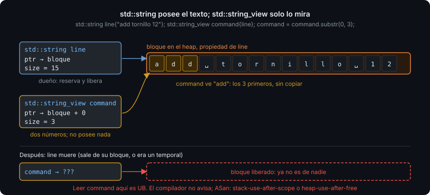

# `std::string` y `std::string_view`

> Casi todo lo que entra en un programa es texto: una línea del usuario, un nombre, un
> comando. `std::string` es la caja que lo guarda; `std::string_view` es la ventana
> para mirarlo sin copiarlo. Saber cuál usar en cada firma es la mitad de escribir
> funciones de texto que no copien ni se cuelguen.

## 🎯 Objetivos

Al terminar este archivo podrás:

- Construir, comparar, concatenar y recorrer un `std::string`
- Buscar dentro de una cadena con `find` y recortar con `substr`, tratando `npos`
  como lo que es: "no está"
- Explicar qué es un `std::string_view`, qué **no** posee, y cuándo su vida útil se
  acaba antes de tiempo
- Leer una línea con `std::getline` y **partirla en palabras** con
  `std::istringstream`, validando cada campo
- Elegir entre `std::string`, `const std::string&` y `std::string_view` para cada
  parámetro y cada valor de retorno

## 1. Qué problema resuelve

En C una cadena es un array de `char` terminado en un cero, y el programador cuenta
los bytes a mano. Un byte de menos y el texto se corta; uno de más y se pisa la
variable de al lado. `std::string` guarda el texto **y su longitud**, reserva memoria
sola cuando crece, y la libera sola al morir. No se cuenta nada.

Pero esa comodidad tiene un coste: cada `std::string` es dueño de su memoria, y
**copiarlo copia el texto entero**. Una función que recibe `std::string` por valor
copia en cada llamada. `const std::string&` evita la copia, pero solo funciona si el
llamador ya tiene un `std::string`: un literal `"add"` obliga a construir uno
temporal. `std::string_view` (C++17) resuelve eso: es una vista de solo lectura
(un puntero al primer carácter y una longitud) sobre texto que pertenece a **otro**.
Mirar sin poseer.

## 2. Cómo funciona

### 2.1 `std::string`: construir, unir, comparar

```cpp
#include <iostream>
#include <string>

int main() {
  std::string name{"tornillo"};
  std::string label{name + " M4"};          // + une; crea un string nuevo
  label += " x100";                         // += añade al final del existente
  std::cout << label << '\n';               // tornillo M4 x100
  std::cout << label.size() << '\n';        // 16: caracteres, no bytes de memoria
  std::cout << (name == "tornillo") << '\n';  // 1: compara contenido, no dirección
  std::cout << (name < "tuerca") << '\n';   // 1: orden alfabético por carácter
  std::cout << label.empty() << '\n';       // 0
}
```

`size()` devuelve `std::size_t`, un entero sin signo. Compararlo con un `int` dispara
`-Wsign-compare`; usa `std::size_t` para índices y tamaños, como en el archivo 01.

### 2.2 Recorrer y acceder

```cpp
#include <iostream>
#include <string>

int main() {
  std::string word{"hola"};
  for (char c : word) {                     // cada carácter, por valor (char es pequeño)
    std::cout << static_cast<int>(c) << ' ';  // 104 111 108 97: su código ASCII
  }
  std::cout << '\n';
  std::cout << word[0] << word.back() << '\n';   // h a
  word[0] = 'H';                            // [] da acceso de lectura y escritura
  std::cout << word << '\n';                // Hola
}
```

`word[i]` **no comprueba** que `i` esté dentro del texto; `word[99]` en una cadena de
cuatro es comportamiento indefinido (archivo 06). `word.at(i)` sí comprueba y aborta
el programa si te pasas (lanza una excepción, Semana 10); es la forma segura hasta
entonces cuando el índice viene de fuera.

### 2.3 Buscar y recortar

```cpp
#include <iostream>
#include <string>

int main() {
  std::string line{"add tornillo 12"};
  std::size_t space{line.find(' ')};        // posición del primer espacio: 3
  if (space == std::string::npos) {         // npos: "no encontrado"
    std::cout << "sin argumentos\n";
    return 0;
  }
  std::string command{line.substr(0, space)};      // desde 0, 3 caracteres: "add"
  std::string rest{line.substr(space + 1)};        // desde 4 hasta el final
  std::cout << '[' << command << "] [" << rest << "]\n";   // [add] [tornillo 12]
  std::cout << line.starts_with("add") << '\n';    // 1 (C++20)
}
```

`find` devuelve la posición o `std::string::npos`, que es el mayor `std::size_t`
posible. **Siempre** se compara antes de usar la posición: `substr(npos + 1)` es
`substr(0)` por desbordamiento de `unsigned`, un error silencioso clásico.
`starts_with` y `ends_with` son de C++20 y sustituyen al viejo `compare(0, n, ...)`.

### 2.4 `std::string_view`: mirar sin poseer

```cpp
#include <iostream>
#include <string>
#include <string_view>

bool is_command(std::string_view word) {    // sin copia venga de donde venga
  return word == "add" || word == "list";
}

int main() {
  std::string typed{"add"};
  std::cout << is_command(typed) << '\n';   // 1: vista sobre el string
  std::cout << is_command("list") << '\n';  // 1: vista sobre el literal, sin string temporal
  std::string_view first{typed};
  first.remove_suffix(1);                   // la vista se encoge; typed no cambia
  std::cout << first << ' ' << typed << '\n';   // ad add
}
```

Un `std::string_view` son **dos números**: dónde empieza el texto y cuántos
caracteres tiene. Copiarlo cuesta lo que copiar dos enteros. Tiene `size`, `find`,
`substr`, `starts_with`, `[]`, `remove_prefix`, `remove_suffix`… y ninguna operación
que modifique el texto, porque **el texto no es suyo**.



Y ahí está la trampa: la vista vive mientras viva el dueño. Si el dueño muere antes,
la vista queda colgante, igual que la referencia del archivo 03:

```cpp
#include <iostream>
#include <string>
#include <string_view>

std::string make_label() { return "temporal"; }

int main() {
  std::string_view view{make_label()};      // ❌ UB: el string temporal muere al final de esta línea
  std::cout << view << '\n';                //    ni GCC ni Clang avisan; ASan: stack-use-after-scope
}
```

Regla: `std::string_view` como **parámetro** de entrada, siempre. Como **variable
local**, solo si el dueño está a la vista y vive más. Como **miembro** o **valor de
retorno**, casi nunca (hasta que sepas exactamente quién es el dueño).

### 2.5 Leer una línea y partirla

`std::cin >> word` lee hasta el primer espacio, lo que sirve para una palabra y falla
para "una línea con espacios". La combinación que el bootcamp usa siempre es: **leer la
línea entera** con `std::getline` y **partirla** con `std::istringstream`, que es un
flujo de entrada que lee de una cadena en vez de del teclado:

```cpp
#include <iostream>
#include <sstream>
#include <string>

int main() {
  std::string line{};
  while (std::getline(std::cin, line)) {
    std::istringstream in{line};
    std::string command{};
    int quantity{};
    if (!(in >> command >> quantity)) {     // false si falta algo o no es un entero
      std::cout << "línea inválida: [" << line << "]\n";
      continue;
    }
    std::cout << command << " × " << quantity << '\n';
  }
}
```

`in >> command >> quantity` intenta leer una palabra y luego un entero. Si el texto
es `add abc`, la lectura de `quantity` falla y toda la expresión se convierte a
`false`. Eso es **validar la entrada**: nunca dar por bueno lo que viene del usuario
sin comprobarlo. Con `add 12 extra` la lectura tiene éxito y `extra` se queda sin
leer; el ejercicio 01 enseña a detectar también eso (`in >> std::ws` y `in.eof()`).

## 3. Cómo se escribe en C++20

```cpp
#include <string>
#include <string_view>

// ✅ entrada de solo lectura: string_view
[[nodiscard]] bool is_valid_name(std::string_view name);

// ✅ devolver texto nuevo: string por valor
[[nodiscard]] std::string to_upper(std::string text);   // recibe copia, la modifica, la devuelve

// ✅ modificar en sitio: string&
void trim_in_place(std::string& text);

// ✅ vista sobre la entrada, devuelta: solo si el llamador conserva el original
[[nodiscard]] std::string_view first_word(std::string_view line);
```

`to_upper(std::string text)` por valor es deliberado: necesita una copia para
modificarla, así que la pide en la firma y el llamador decide si le entrega una
variable (se copia) o un temporal (no se copia). Es el único caso en que un
`std::string` por valor es la firma correcta.

## 4. Antipatrones

| Qué hace la gente | Por qué duele | Qué hacer |
| --- | --- | --- |
| `void print(std::string s)` | Copia todo el texto en cada llamada solo para leerlo | `std::string_view s` |
| `std::string_view sv{a + b};` | `a + b` es un temporal; muere al final de la línea; `sv` queda colgante. UB sin aviso del compilador; ASan lo caza | `std::string joined{a + b};` |
| `line.substr(line.find(':') + 1)` sin comprobar `npos` | Si no hay `:`, `npos + 1` es 0 y `substr(0)` devuelve la línea entera: un bug silencioso | `if (auto pos{line.find(':')}; pos != std::string::npos)` |
| `for (int i = 0; i < s.size(); ++i)` | `-Wsign-compare`: `int` contra `std::size_t`; con `-Werror` no compila | `std::size_t i{0}`, o `for (char c : s)` |
| `std::cin >> line` para leer una frase | Se queda en el primer espacio; el resto se lee en la siguiente vuelta y descoloca todo | `std::getline(std::cin, line)` |
| Dar por leído sin mirar el resultado de `>>` | `add abc` deja `quantity` en 0 y el programa sigue como si nada | `if (!(in >> quantity)) { /* inválido */ }` |
| `std::stoi(text)` para convertir | Con `"abc"` lanza una excepción que no sabes atrapar hasta la Semana 10: el programa muere | `std::istringstream in{text}; if (!(in >> n))` |
| Comparar con `==` un `char` y un literal `"a"` | `'a'` es un `char`; `"a"` es una cadena de dos caracteres (`a` y el cero final). Error de tipos | Comillas simples para un carácter |

## 5. Trucos

- **Ver qué hay de verdad en una cadena** — `std::cout << '[' << s << "]\n"`. Los
  corchetes delatan espacios al principio o al final y líneas vacías, invisibles sin
  ellos. Todos los tests de esta semana imprimen así.
- **`std::string::npos` en `gdb`** — se muestra como `18446744073709551615`. Si ves ese
  número en una variable de posición, un `find` no encontró y no lo comprobaste.
- **Un `string_view` se puede imprimir en `gdb`** — `print view` muestra el texto y la
  longitud; si el texto parece basura, el dueño ya murió.
- **`std::getline` con otro separador** — `std::getline(in, field, ',')` lee hasta la
  coma. Es la forma más corta de partir un CSV, y la que usarás en la Semana 10.

## 📚 Recursos Adicionales

- [cppreference — `std::string`](https://en.cppreference.com/w/cpp/string/basic_string) —
  la tabla de miembros es larga; hoy: `size`, `empty`, `find`, `substr`, `starts_with`,
  `operator+=`, `operator[]`, `at`, `back`.
- [cppreference — `std::string_view`](https://en.cppreference.com/w/cpp/string/basic_string_view) —
  fíjate en que no hay ningún miembro que modifique el texto.
- [cppreference — `std::getline`](https://en.cppreference.com/w/cpp/string/basic_string/getline) —
  y por qué devuelve el flujo, lo que permite usarla como condición de `while`.
- [cppreference — `std::istringstream`](https://en.cppreference.com/w/cpp/io/basic_istringstream) —
  el flujo que lee de una cadena.
- [C++ Core Guidelines — SL.str.2: Use `std::string_view` to refer to character sequences](https://isocpp.github.io/CppCoreGuidelines/CppCoreGuidelines#slstr2-use-stdstring_view-or-gslspanchar-to-refer-to-character-sequences) —
  y SL.str.1 (usar `std::string` para poseer texto).

## ✅ Checklist de Verificación

- [ ] Sé qué guarda un `std::string` además del texto, y qué pasa al copiarlo
- [ ] Sé qué es `npos`, quién lo devuelve y por qué se comprueba antes de usar la posición
- [ ] Puedo explicar qué son los dos números de un `std::string_view` y por qué no posee nada
- [ ] Sé cuándo un `std::string_view` queda colgante y qué sanitizer lo detecta
- [ ] Sé partir una línea con `std::istringstream` y detectar que un campo no es un entero
- [ ] Sé elegir entre `std::string`, `const std::string&` y `std::string_view` en una firma
